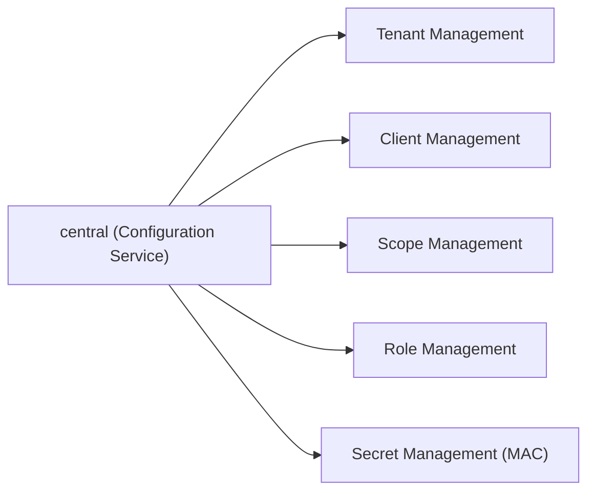
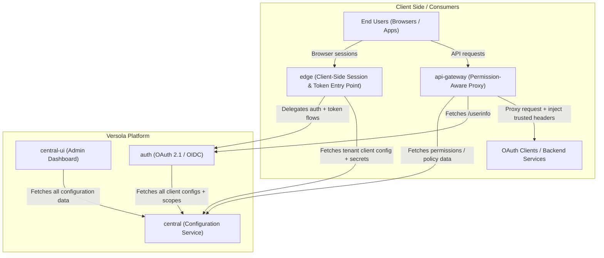
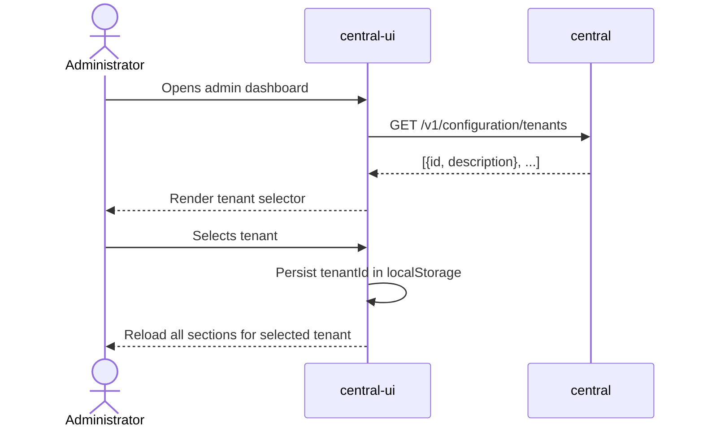
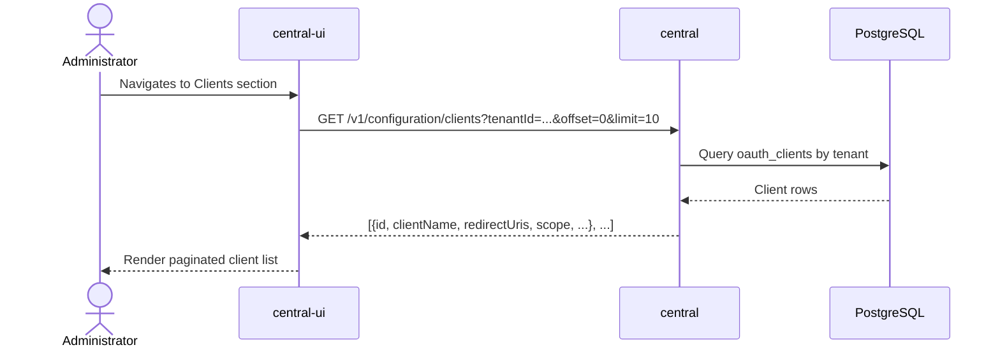
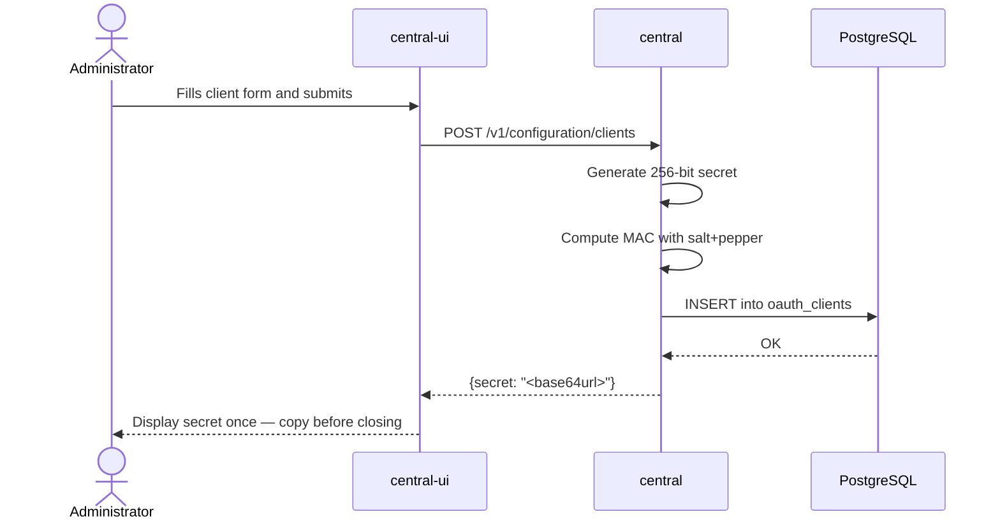
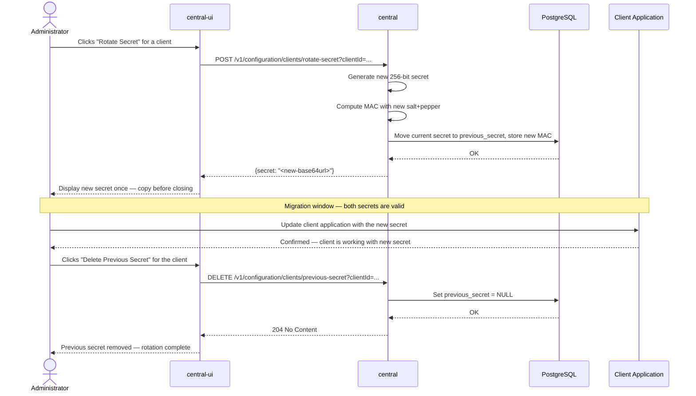
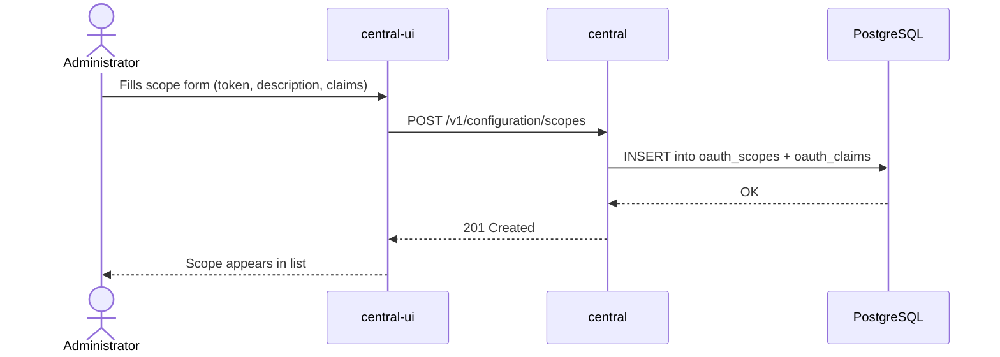
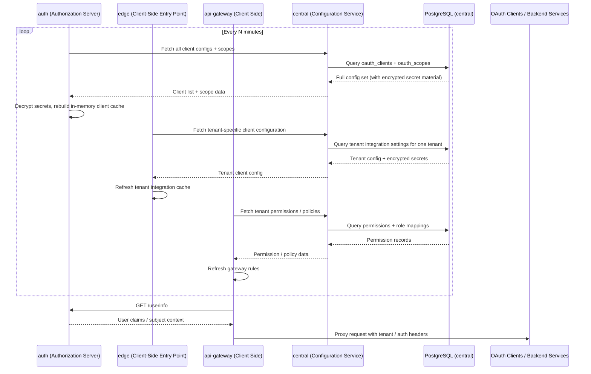

# ADR 03: Central Service Architecture

**Status:** Proposed  
**Date:** 2026-04-02  
**Author:** Georgii Kovalev  
**Context:** Configuration Management and Administrative UI

---

## Executive Summary

This ADR describes the purpose and high-level architecture of the **central service**, the communication model between the **central-ui** frontend and that service, and the way runtime consumers fetch tenant-scoped configuration from it. The central service is the single source of truth for all OAuth 2.1 / OIDC configuration across tenants, including client metadata, secret-bearing tenant integrations, roles, and permissions. The frontend is a standalone Web Component dashboard that communicates with it over plain HTTP REST.

---

## 1. Context

### 1.1 The Problem Space

An OAuth 2.1 / OIDC authorization platform requires a place where operators can define and manage the configuration that the authorization server relies on: which clients are registered, what scopes exist, which claims belong to a scope, how roles and permissions are structured, and which tenant a resource belongs to.

Without a dedicated service for this, such configuration would either be scattered across the authorization server itself, or managed through direct database access — both of which create operational risk and couple concerns that should be independent.

### 1.2 Multi-Tenancy

Versola is designed to serve multiple independent tenants from a single deployment. Every resource — clients, scopes, roles, permissions — is scoped to a tenant. The central service is the authority for this boundary and enforces it on every query and mutation.

---

## 2. What the Central Service Is

The central service is a dedicated **configuration and management backend**. It is not involved in any OAuth protocol flow. Its responsibility is to provide a secure, authoritative interface through which the platform is configured and from which runtime components retrieve tenant-scoped configuration.

### 2.1 Responsibilities

**Tenant Management** — Tenants are the top-level organizational units. The central service stores their identities and descriptions. All other resources belong to a tenant.

**OAuth Client Management** — Operators register OAuth clients through the central service. Registration involves defining redirect URIs, allowed scopes, external audience entries, and a client name. The service generates a cryptographically secure secret on registration (see ADR 00 for the MAC scheme). Secret rotation is also handled here, storing both the new and previous secret to allow zero-downtime migrations.

**Scope and Claim Management** — Scopes group claims. The central service owns the authoritative list of scopes and the claims attached to them, keyed per tenant.

**Role and Permission Management** — Roles aggregate permissions. The central service manages role lifecycle including soft deletion and permission assignment.

**Runtime Configuration Distribution** — The central service is also the distribution point for runtime consumers. The `auth` service fetches the full client and scope configuration set, the client-side deployed `edge` service fetches only tenant-specific client configuration including secret-bearing integration settings, and client-side API gateways fetch permission data used to evaluate and enrich proxied requests.

**Secret Encryption for Internal Consumers** — When the central service returns sensitive configuration to internal consumers (such as the `auth` or `edge` service), secret-bearing fields are encrypted before serialization for service-to-service transport. The admin UI receives only non-sensitive metadata — client name, redirect URIs, allowed scopes — and never receives raw secret material.

### 2.2 What the Central Service Is Not

The central service does not handle any OAuth protocol requests — no `/authorize`, `/token`, `/introspect`, or `/userinfo`. It does not issue tokens. It has no session concept. It is a pure configuration plane, separate from the data plane that the `auth` service handles.

---

## 3. High-Level Architecture

Versola is composed of control-plane services plus client-side deployed traffic components that also consume configuration from `central`.

**auth** is the OAuth 2.1 / OIDC authorization server. It handles end-user authorization flows, token issuance, token introspection, revocation, and the UserInfo endpoint. It persists its own state (sessions, authorization codes, refresh tokens, users) in a dedicated database and fetches the full client and scope configuration set from `central`.

**edge** is a client-side deployed session and token entry-point service. It fronts browser interactions and `/v1/token` requests before delegating OAuth handling to the `auth` service. It maintains its own session store and retrieves only tenant-specific client configuration from `central`, including secret-bearing settings required for tenant integrations.

**central** is the configuration service described in this ADR. It holds the canonical definition of tenants, clients, scopes, roles, and permissions in its own database.

**api-gateway** is a client-side deployed permission-aware proxy. It retrieves permission data from `central`, calls the `auth` service `userinfo` endpoint to resolve user context, evaluates or applies gateway policy from that data, and then forwards requests to tenant backend services or other OAuth client runtimes with trusted headers that carry the resolved tenant and authorization context.

**central-ui** is the administrative frontend. It is a Web Component library built with Lit and TypeScript, packaged as a single ES module. It communicates exclusively with the `central` service to perform configuration operations.

Auth, central, and edge each own their PostgreSQL database. There is no shared database between them. All inter-service coupling is through clearly defined HTTP APIs, and client-side deployed components consume only the slices of configuration that `central` explicitly exposes to them.

Observability is built into every service via OpenTelemetry tracing, structured JSON logging, and Prometheus metrics exposed on a separate diagnostics port.

---

## 4. Frontend (central-ui) and Central Service Communication

### 4.1 Nature of the Communication

The frontend communicates with the central service over **synchronous HTTP REST**. Requests originate from the browser, target the central service API, and receive JSON responses. There is no real-time channel, no WebSocket, and no event streaming at this stage.

All API paths are versioned under `/v1/configuration/`. Listing endpoints accept optional `offset` and `limit` query parameters for pagination. All resource endpoints require a `tenantId` query parameter to enforce tenant isolation.

The client list response contains only non-sensitive metadata — name, redirect URIs, allowed scopes. No secret material is ever returned to the UI.

### 4.2 Initial Page Load — Tenant Selection

When the dashboard opens, it fetches the list of available tenants and presents a selector. The selected tenant is persisted in `localStorage` so it survives page reloads. Switching tenants causes all child components to re-fetch their data for the new context.

### 4.3 Browsing Clients

### 4.4 Creating a Client

The secret is generated server-side and returned exactly once in the creation response. It is never retrievable again — subsequent reads of the client list do not include it.

### 4.5 Rotating a Client Secret

Secret rotation stores both the new and the previous secret simultaneously. This allows existing client instances still using the old secret to keep working during a migration window. Once the administrator has updated all client applications to the new secret, the previous secret is explicitly deleted through the API to close the transition window.

### 4.6 Creating a Scope

### 4.7 Security Model for the Communication Channel

At the current development stage, the communication between the frontend and the central service is unauthenticated. This is a known gap — the API is not exposed to the public internet in the current deployment topology, which partially mitigates the risk during development.

The decision on how to authenticate the admin dashboard against the central service (e.g., via a shared secret, an OAuth client credentials grant from the `auth` service, or a separate admin token) is deferred and will be addressed in a future ADR.

### 4.8 Frontend Architecture

The frontend is distributed as a compiled ES module (`versola-admin.js`). The entry point is a single `<versola-admin>` custom element that hosts the entire dashboard. Internally it composes smaller Web Components (`versola-clients-list`, `versola-client-form`, etc.) that each own a slice of the UI.

At the time of this writing the frontend uses static mock data for development purposes. The integration with the central service REST API is the immediate next step and will replace all mock data imports with fetch calls to `/v1/configuration/...` endpoints.

---

## 5. Runtime Consumers and Central Service Configuration Sync

Runtime consumers do not share a database with `central`. Instead, they periodically fetch the slices of configuration they need and cache or apply them locally. The `auth` service fetches the full client and scope configuration set, while the client-side deployed `edge` service fetches only tenant-specific client configuration and secret-bearing tenant integration settings. Client-side gateways fetch permission data from `central` and user context from `auth`. This keeps `central` as the system of record while allowing runtime components to serve their traffic without a round-trip to `central` on every request.

Sensitive secret-bearing configuration returned to runtime consumers is encrypted specifically for service-to-service channels. The decryption key lives only in the consuming service configuration and never in the browser.

---

## 6. Alternatives Considered

**GraphQL** — Was considered for the admin API to allow flexible querying. Rejected at this stage because the resource model is simple and well-known ahead of time, and GraphQL adds schema management overhead that is not justified for an internal admin interface.

**gRPC** — Considered for strict schema and efficient serialization. Rejected because it complicates browser-to-service communication significantly (requires a proxy or gRPC-Web), adding operational complexity with no meaningful benefit at current scale.

**Embedding admin into the auth service** — The `auth` service already has an `AdminController` with an older admin endpoint design. Keeping configuration management separate from the authorization server means the two concerns can evolve and scale independently, and the auth service is not burdened with CRUD logic.

---

## 7. Consequences

- The central service must be deployed and reachable by `central-ui`, `auth`, client-side deployed `edge`, and client-side API gateways that need to read configuration.
- The authentication gap between central-ui and the central service must be addressed before any production deployment.
- The frontend integration work (replacing mock data with API calls) is a required milestone before the system can be considered operationally complete.
- Runtime consumers depend on the central service being available and up to date — a stale or unreachable central service means auth caches, edge tenant configuration, and API gateway permission data may drift until the next successful sync.

---

## 8. References

1. ADR 00 — Client Secret Storage (MAC with salt+pepper)
2. OAuth 2.1 Draft — https://datatracker.ietf.org/doc/html/draft-ietf-oauth-v2-1-11
3. Lit Web Components — https://lit.dev
4. The Twelve-Factor App — https://12factor.net

